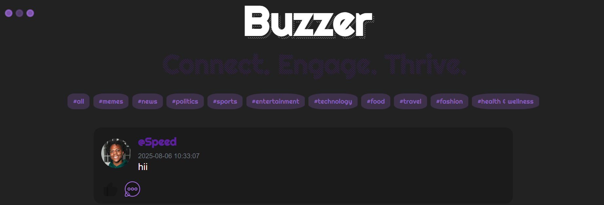
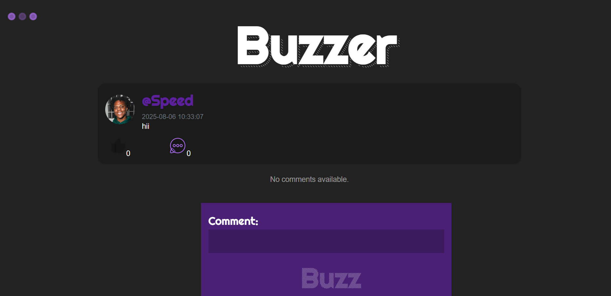
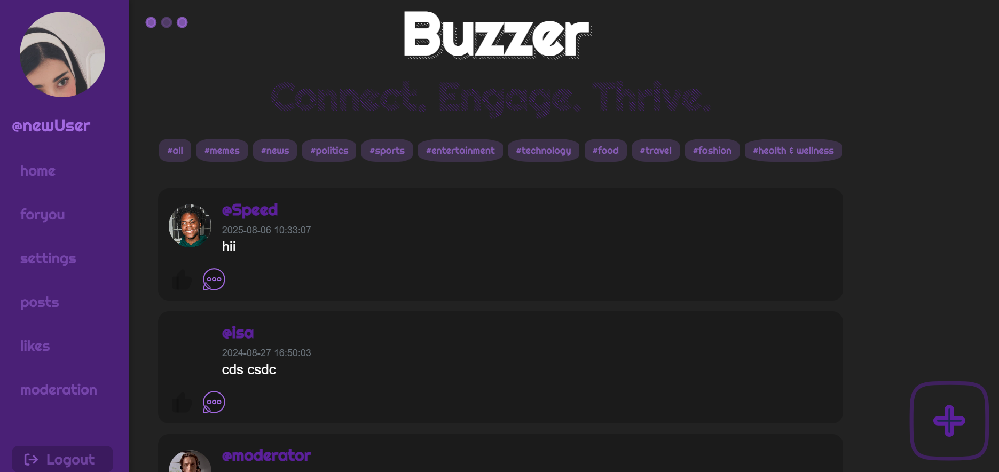
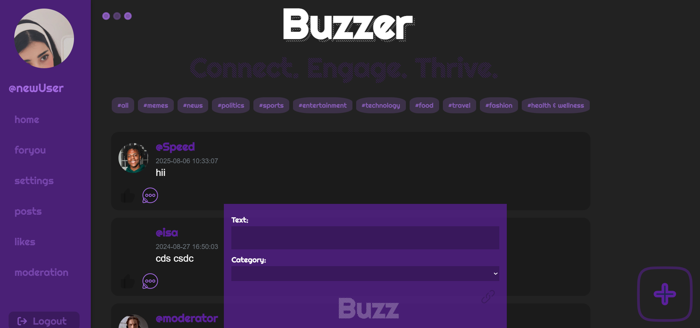
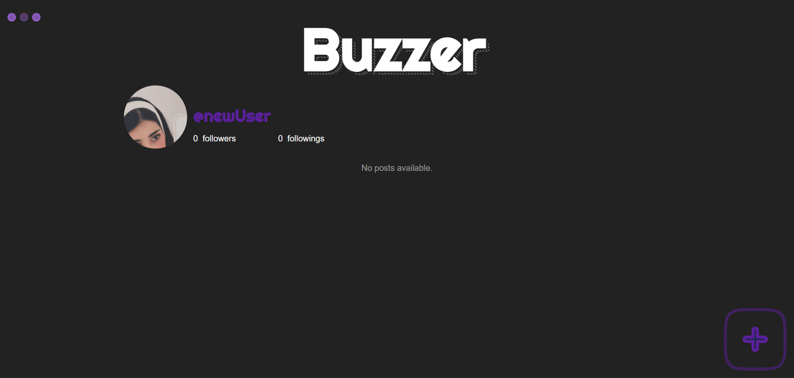

# 📥 Web Forum

A fully functional web-based forum built using **Go**, **SQLite**, implementing user authentication, posts, comments, likes/dislikes, filtering, and session management with cookies — all without any frontend frameworks.

---

## Features

- 🗣️ **User Communication**
  - Registered users can create posts and comments
  - Public visibility of all content 

- 🧭 **Categories**
  - Posts can be tagged with one or more categories
  - Users can filter posts by category

- 👍 **Likes / Dislikes**
  - Registered users can like or dislike posts and comments
  - Reaction counts visible to all users

- 🔍 **Filtering**
  - Filter by category 
  - Filter by user’s posts or liked posts 

- 🛡️ **Authentication**
  - Registration and login system
  - Session expiration support

---

## Technologies Used

- **Backend**: Go (Golang)
- **Database**: SQLite 

---

## Getting Started

### 1. Clone the repository

```bash
git clone https://github.com/NADRA03/F_U_R_U_M.git
````

### 2. Build & Run with Docker

```bash
go run main.go
```

The application will be accessible at:
👉 `http://localhost:8080`

---

## Project Structure

```
F_U_R_U_M/
├── main.go
├── handlers/             
├── assets/           
├── html/           
├── static/               
└── README.md
```
---

## Registration Requirements

* Email (must be unique)
* Username
* Password (stored encrypted using bcrypt)
* Error returned on duplicate email or wrong login credentials

---

## Session Management

* Users are authenticated via cookies
* Only one session per user allowed
* Cookies contain UUID and expiration date

---

## SQLite

The database stores:

* Users
* Posts
* Comments
* Categories
* Reactions (likes/dislikes)

---

## Allowed Go Packages

* `net/http`
* `html/template`
* `database/sql`
* `github.com/mattn/go-sqlite3`
* `github.com/gorilla/sessions`
* `github.com/gorilla/securecookie`
* `github.com/google/gofuzz`

---

## Preview

  
  
  
  
  
  

---

## License

MIT License

---

## Author

Made with ❤️ by [NADRA03](https://github.com/NADRA03), [AsalarS](https://github.com/AsalarS), [Abdulla-22](https://github.com/Abdulla-22).


